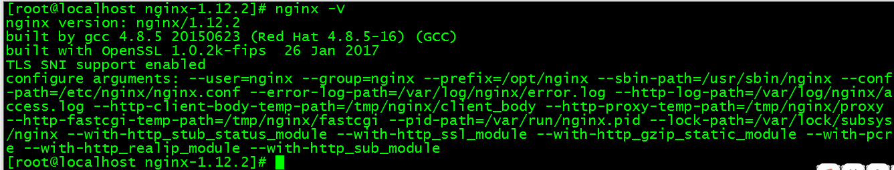

yum install glib2-devel openssl-devel pcre-devel bzip2-devel gzip-devel   && yum groupinstall Development Tools -y

```
需要用到的安装包：
```

openssl-devel

zlib-devel

pcre-devel

gcc

nginx-1.2.2.tar.gz

1、解决依赖关系

编译安装nginx需要事先需要安装开发包组"Development Tools"和 "Development Libraries"。同时，还需要专门安装pcre-devel包，安装pcre 库是为使用Nginx支持 HTTP Rewrite 模块。

\# yum -y install pcre-devel

2、首先添加nginx用户和组,实现以之运行nginx服务进程

\# groupadd -r nginx

\# useradd -r -g nginx -s /bin/false -M nginx

\# id nginx

1. 解压

   \# tar xf nginx-1.2.2.tar.gz

稳定版本：

wget [http://nginx.org/download/nginx-1.12.2.tar.gz](http://nginx.org/download/nginx-1.12.2.tar.gz)

tar zxvf nginx-1.12.2.tar.gz

比较全的编译参数

./configure --prefix=/usr --sbin-path=/usr/bin/nginx --conf-path=/etc/nginx/nginx.conf --error-log-path=/var/log/nginx/error.log --http-log-path=/var/log/nginx/access.log --pid-path=/var/run/nginx/nginx.pid  --lock-path=/var/lock/nginx.lock --user=nginx --group=nginx --with-http\_ssl\_module --with-http\_flv\_module --with-http\_stub\_status\_module --with-http\_gzip\_static\_module --http-client-body-temp-path=/var/tmp/nginx/client/ --http-proxy-temp-path=/var/tmp/nginx/proxy/ --http-fastcgi-temp-path=/var/tmp/nginx/fcgi/ --http-uwsgi-temp-path=/var/tmp/nginx/uwsgi --http-scgi-temp-path=/var/tmp/nginx/scgi --with-pcre

一些参数

./configure --user=nginx --group=nginx --prefix=/opt/nginx --sbin-path=/usr/sbin/nginx --conf-path=/etc/nginx/nginx.conf --error-log-path=/var/log/nginx/error.log --http-log-path=/var/log/nginx/access.log --http-client-body-temp-path=/tmp/nginx/client\_body --http-proxy-temp-path=/tmp/nginx/proxy --http-fastcgi-temp-path=/tmp/nginx/fastcgi --pid-path=/var/run/nginx.pid --lock-path=/var/lock/subsys/nginx --with-http\_stub\_status\_module --with-http\_ssl\_module --with-http\_gzip\_static\_module --with-pcre --with-http\_realip\_module --with-http\_sub\_module

一些参数的解释

--prefix=&lt;path&gt; - Nginx安装路径。如果没有指定，默认为 /usr/local/nginx。

  --conf-path=&lt;path&gt;在没有给定-c选项下默认的nginx.conf的路径。如果没有指定，默认为&lt;prefix&gt;/conf/nginx.conf。   

--error-log-path=&lt;path&gt; - 在nginx.conf中没有指定error\_log指令的情况下，默认的错误日志的路径。如果没有指定，默认为 &lt;prefix&gt;/logs/error.log。

--http-log-path=&lt;path&gt; - 在nginx.conf中没有指定access\_log指令的情况下，默认的访问日志的路径。如果没有指定，默认为 &lt;prefix&gt;/logs/access.log。

--user=&lt;user&gt; - 在nginx.conf中没有指定user指令的情况下，默认的nginx使用的用户。如果没有指定，默认为 nobody。

--group=&lt;group&gt; - 在nginx.conf中没有指定user指令的情况下，默认的nginx使用的组。如果没有指定，默认为 nobody。

--with-http\_ssl\_module -开启HTTP SSL模块，使NGINX可以支持HTTPS请求。需要安装了OPENSSL

--with-http\_flv\_module

--with-http\_stub\_status\_module - 启用 "server status" 页\(可有可无\)

--without-http\_gzip\_module - 禁用 ngx\_http\_gzip\_module. 如果启用，需要 zlib 。

--without-http\_ssi\_module - 禁用 ngx\_http\_ssi\_module

--without-http\_referer\_module - 禁用 ngx\_http\_referer\_module

--without-http\_rewrite\_module - 禁用 ngx\_http\_rewrite\_module. 如果启用需要 PCRE 。

--without-http\_proxy\_module - 禁用 ngx\_http\_proxy\_module

--without-http\_fastcgi\_module - 禁用 ngx\_http\_fastcgi\_module

--without-http\_memcached\_module - 禁用 ngx\_http\_memcached\_module

--without-http\_browser\_module - 禁用 ngx\_http\_browser\_module

--http-proxy-temp-path=PATH - Set path to the http proxy temporary files

--http-fastcgi-temp-path=PATH - Set path to the http fastcgi temporary files

--without-http - 禁用 HTTP server（用作代理或反向代理）

--with-mail - 启用 IMAP4/POP3/SMTP 代理模块

--with-mail\_ssl\_module - 启用 ngx\_mail\_ssl\_module

--with-openssl=DIR - Set path to OpenSSL library sources

编译完成以后的结果：



安装完以后遇到的一些问题：


问题二：

安装完以后用户是root非nginx，原因是因为编译的时候没有加入--user=nginx --group nginx参数

创建启动脚本：

vi /etc/rc.d/init.d/nginx


\#!/bin/bash

\# chkconfig: - 18 21

\# description: http service.

\# Source Function Library

. /etc/init.d/functions

\# Nginx Settings

NGINX\_SBIN="/usr/sbin/nginx"

NGINX\_CONF="/etc/nginx/nginx.conf"

NGINX\_PID="/var/run/nginx.pid"

RETVAL=0

prog="Nginx"

\#Source networking configuration

. /etc/sysconfig/network

\# Check networking is up

\[ ${NETWORKING} = "no" \] && exit 0

\[ -x $NGINX\_SBIN \] \|\| exit 0

start\(\) {

        echo -n $"Starting $prog: "

        touch /var/lock/subsys/nginx

        daemon $NGINX\_SBIN -c $NGINX\_CONF

        RETVAL=$?

        echo

        return $RETVAL

}

stop\(\) {

        echo -n $"Stopping $prog: "

        killproc -p $NGINX\_PID $NGINX\_SBIN -TERM

        rm -rf /var/lock/subsys/nginx /var/run/nginx.pid

        RETVAL=$?

        echo

        return $RETVAL

}

reload\(\){

        echo -n $"Reloading $prog: "

        killproc -p $NGINX\_PID $NGINX\_SBIN -HUP

        RETVAL=$?

        echo

        return $RETVAL

}

restart\(\){

        stop

        start

}

configtest\(\){

    $NGINX\_SBIN -c $NGINX\_CONF -t

    return 0

}

case "$1" in

  start\)

        start

        ;;

  stop\)

        stop

        ;;

  reload\)

        reload

        ;;

  restart\)

        restart

        ;;

  configtest\)

        configtest

        ;;

  \*\)

        echo $"Usage: $0 {start\|stop\|reload\|restart\|configtest}"

        RETVAL=1

esac

exit $RETVAL

添加权限：

chmod 755 /etc/init.d/nginx

chkconfig --add nginx

chkconfig nginx on

防火墙规则：

\[root@www ~\]\# firewall-cmd --permanent --add-port=80/tcp

\[root@www ~\]\# firewall-cmd --reload

step3：控制nginx服务的命令

1、启动：nginx

2、停止：nginx -s stop

3、退出：nginx -s quit

4、重启：nginx -s reopen

5、重新加载：nginx -s reload

6、平滑启动：kill -HUP pid（kill -HUP cat /var/run/nginx.pid）

